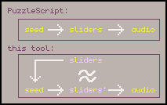

# PuzzleScript SFX Unscrambler

The sound effect system for PuzzleScript is brilliant -- you have a very small amount of control over what sounds it can randomly generate, and you press the "random" button repeatedly until you find something good enough. The whole process takes maybe 30 seconds at minimum, and you can get back to making your levels.

But if you're really picky about the sounds... you can press "random" for hours. This tool will hopefully help you -- it gives you sliders that you can use to build the sound you want, and then searches through the entire (?) seed-space to find a seed that produces a sound closest* to the one you wanted.

## Project Status

This is pretty rough and not the easiest to use. I'm unlikely to do much more work on this, but pull requests (or people wanting to become maintainers?) are welcome.

## Usage guide

Use the tool [here](https://pancelor.github.io/puzzlescript-sfx-unscrambler).

* Import a PuzzleScript seed (e.g. "74324308") at the top, if you want
* Adjust the sliders to your liking.
  * Press "play" to play the current sliders, or select "autoplay"
* When the sliders sound like what you want, press "search". The tool will begin looking for (and playing) similar sounds
  * Candidate sounds will be appended to the webpage; click on them later to hear them again
    * Not all sounds will be played while searching (to spare your eardrums)
  * It takes a while to search through all sounds. As it continues, it gets pickier about what sounds are "close enough" or not.
  * When it's complete (or cancelled), it will show a list of the top-20 "closest" sounds found

## What exactly does "closest" mean?

Each seed generates a set of sliders; these sliders are compared against your input sliders. The "distance" is defined as a weighted sum-of-squared-error; search for "function diff(" in [src/sfxr.js](./src/sfxr.js) for more information

The weights were chosen with _some_ thought, but not too much thought; they could use some work.

## todo

* [ ] choose better default weights
* [ ] let user set custom weights?
* [ ] much wider sliders
* [ ] show slider zones -- some area are very unlikely to get randomly selected by the puzzlescript algorithm.
  * could show the distribution of that slider's value across every seed
* [x] interruptable search somehow (...web workers? requestAnimationFrame?)
* [ ] many results, not just the best so far... maybe add anything better than the 50 best so far? anything below 1?
* [ ] increase search space - maybe just 1 more digit. I don't see how this would get you new sounds (based on the code) but it certainly seems to...
* [ ] db approach? 1000000 * 10 * 23 floats = ... 230MB of database? easy
* [ ] pause sfx when a new one plays
